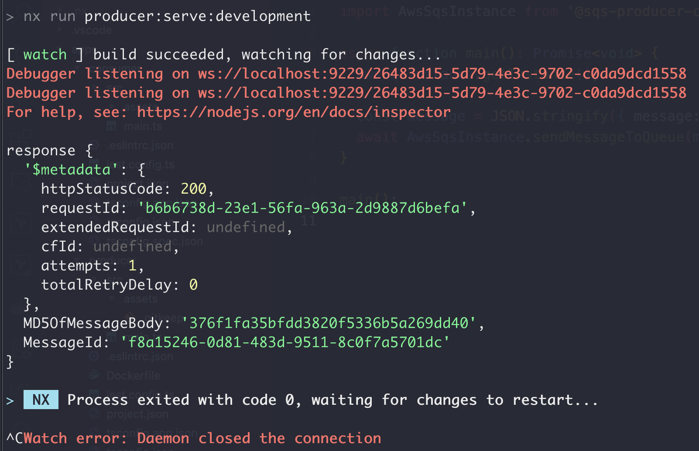
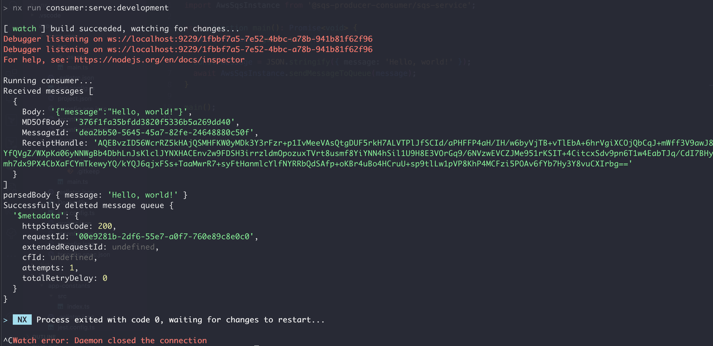

# NX Example with AWS SQS

This repository outlines an example of using NX to create a monorepo that houses code for your `producer` and `consumer` codebases that use AWS SQS. Moreover, it also shows that code can be further abstracted through the use of `libs`, where we house our repo-wide constants (`libs/app-constants`) and our class util for AWS SQS (`libs/sqs-service`).

## Screenshots

Terminal outputs from both the producer and consumer codes:

